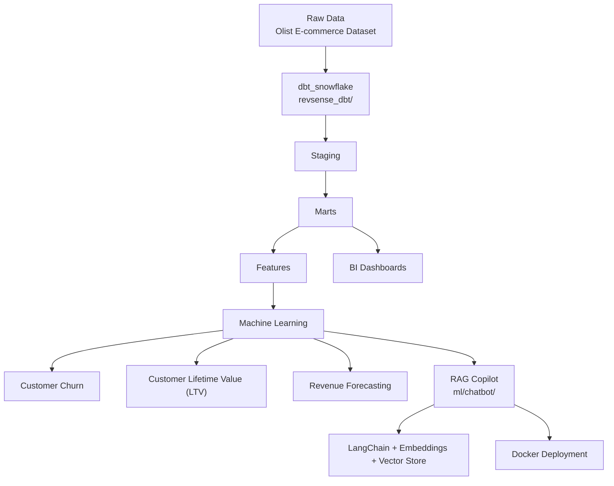

# RevSense-AI
End-to-end revenue intelligence platform — dbt-based data modeling, ML pipelines for churn/LTV/revenue forecasting, and a retrieval-augmented (RAG) copilot — built on the Brazilian Olist e-commerce dataset.

## Project Workflow

# What's implemented

- Data modeling — a dbt project (revsense_dbt/) with staging, intermediate, feature, and mart layers producing analytics-ready tables.
- Machine learning — training scripts for churn prediction, customer lifetime value (LTV), and monthly revenue forecasting (ml/train_revenue_models.py), with trained artifacts saved to ml/models/.
- RAG copilot — a retrieval-augmented chatbot (ml/chatbot/, entry point app_industry.py) built on LangChain, HuggingFace embeddings, and a Chroma/FAISS vector store.
- Reproducible deployment — Dockerfile and requirements-chatbot.txt for a CPU-only runtime (Python 3.11), installing PyTorch CPU wheels first to avoid dependency resolution issues.

# Execution

1. Create and activate a virtual environment
python -m venv .venv
source .venv/bin/activate

2. Install core dependencies
pip install -r requirements.txt
pip install -r requirements-ml.txt

3. (Optional) configure environment for ML workflows
cp ml/.env.example ml/.env
edit ml/.env for Snowflake or other credentials 

4. Run dbt (if you have a warehouse configured)
cd revsense_dbt && dbt debug && dbt run && cd ..

5. Train example models
python ml/train_revenue_models.py

- Running the copilot

The chatbot depends on binary packages (CPU PyTorch, FAISS/Chroma), so the Dockerfile is the recommended way to run it reproducibly.

1. Build the image
docker build -t revsense-chatbot -f ml/chatbot/Dockerfile .

2. Build the vector index (mounts repo so the container can access files)
docker run --rm -v "$PWD":/app revsense-chatbot python ml/chatbot/app_industry.py --build-index

3. Query the copilot
docker run --rm -v "$PWD":/app revsense-chatbot python ml/chatbot/app_industry.py --query "What is customer lifetime value?"
